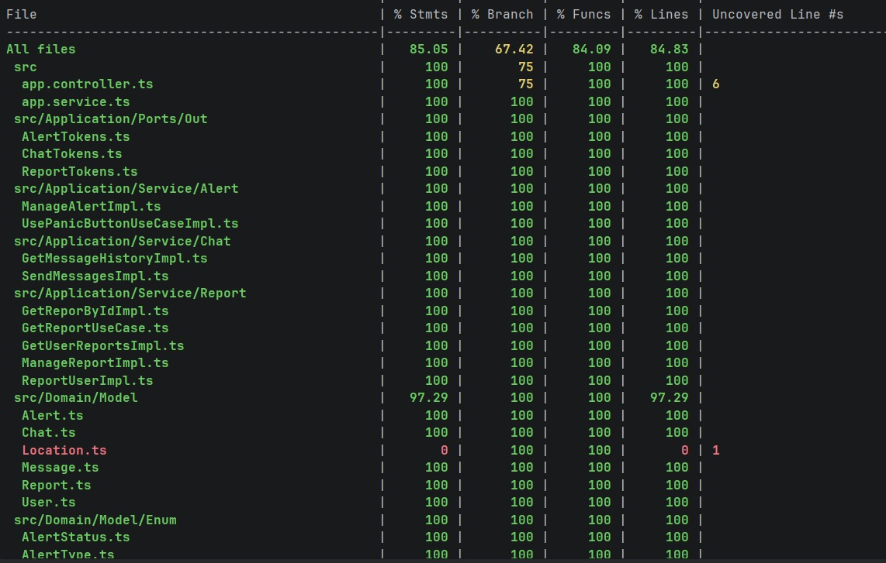
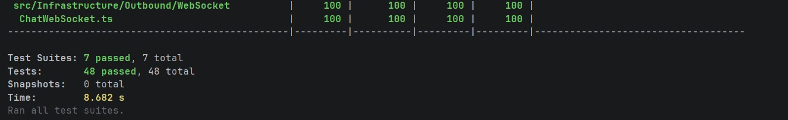
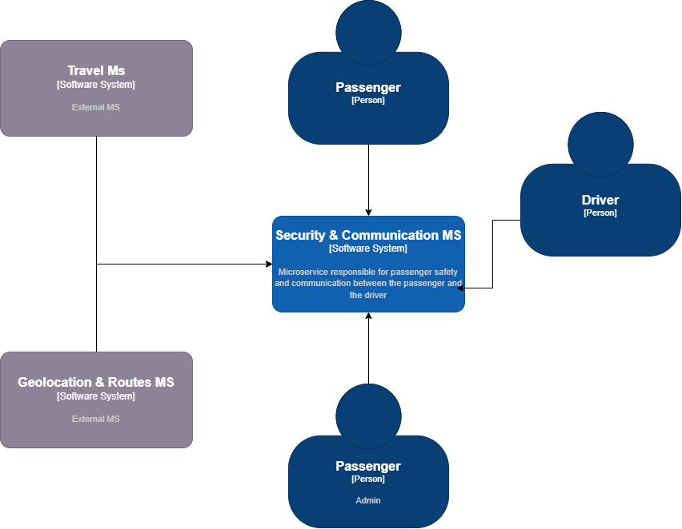
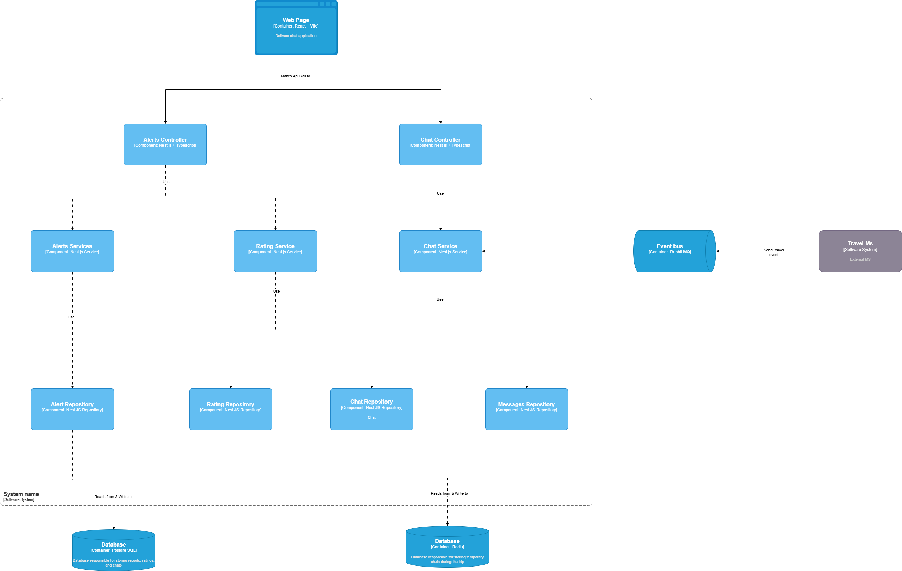
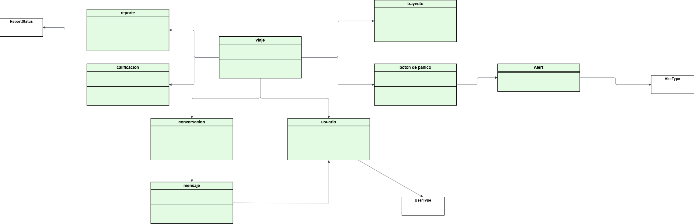

# Rideci Security & Communication Service

Servicio REST y WebSocket de la plataforma **RIDECI LEGACY** para gestionar reportes, alertas, chat en tiempo real y eventos de comunicación entre microservicios.

Está construido con **NestJS**, **Prisma** sobre **PostgreSQL**, **Redis** para soporte de datos temporales y **RabbitMQ** para mensajería asíncrona. La documentación interactiva se expone con **Swagger**.

---

## Tecnologías principales

| Tecnología | Uso |
| --- | --- |
| NestJS 11 | Framework principal |
| Prisma 7 + PostgreSQL | Persistencia principal |
| Redis | Caché y soporte de datos temporales |
| RabbitMQ | Publicación y consumo de eventos |
| Socket.IO | Chat en tiempo real |
| Swagger / OpenAPI | Documentación de la API |

---

## Arquitectura

El proyecto sigue una **Arquitectura Hexagonal (Ports & Adapters)**. La lógica de negocio vive en la capa de aplicación y dominio, mientras que la infraestructura se encarga de HTTP, WebSocket, Redis, Prisma y RabbitMQ.

```text
src/
├── Domain/
│   ├── Model/          # Entidades, enums y objetos de dominio
│   └── Repository/     # Contratos de persistencia
├── Application/
│   ├── Ports/         # Puertos de entrada y salida
│   └── Service/       # Casos de uso
└── Infrastructure/
	├── Config/        # Prisma, Redis, RabbitMQ y módulos Nest
	├── Inbound/       # Controladores HTTP y WebSocket
	└── Outbound/      # Adaptadores de persistencia y mensajería
```

---

## Funcionalidades

- Gestión de reportes de usuarios.
- Cambio de estado de reportes.
- Historial y envío de mensajes en chat.
- Activación del botón de pánico.
- Gestión de alertas.
- Integración con eventos por RabbitMQ.
- Exposición de endpoints REST y eventos WebSocket.

---

## Variables de entorno

Crea un archivo `.env` en la raíz del proyecto y define, como mínimo, estas variables:

```env
DATABASE_URL=postgresql://<usuario>:<password>@<host>:5432/<database>
RABBITMQ_URL=amqp://localhost
REDIS_HOST=localhost
REDIS_PORT=6379
REDIS_PASSWORD=
PORT=3000
```

`RABBITMQ_URL` tiene valor por defecto `amqp://localhost` si no se define.

---

## Requisitos previos

- Node.js 18 o superior.
- npm.
- PostgreSQL.
- Redis.
- RabbitMQ.

---

## Instalación y ejecución

1. Clona el repositorio.

```bash
git clone <url-del-repositorio>
```

2. Instala dependencias.

```bash
npm install
```

3. Genera el cliente de Prisma.

```bash
npm exec prisma generate
```

4. Ejecuta el servicio en desarrollo.

```bash
npm run start:dev
```

5. Para producción, compila y arranca el build.

```bash
npm run build
npm run start:prod
```

---

## Scripts disponibles

- `npm run start` inicia la app.
- `npm run start:dev` inicia en modo desarrollo con recarga.
- `npm run build` compila TypeScript.
- `npm run lint` ejecuta ESLint.
- `npm run test` ejecuta pruebas unitarias.
- `npm run test:cov` ejecuta pruebas con cobertura.
- `npm run test:e2e` ejecuta pruebas end-to-end.

---

## Accesos

| Recurso | URL |
| --- | --- |
| API | http://localhost:3000 |
| Swagger | http://localhost:3000/docs |

---

## Endpoints REST

### Reportes

| Método | Ruta | Descripción |
| --- | --- | --- |
| GET | `/reports` | Obtiene todos los reportes |
| GET | `/reports/:id` | Obtiene un reporte por id |
| GET | `/reports/user/:userId` | Obtiene los reportes de un usuario |
| PATCH | `/reports/:id` | Cambia el estado de un reporte |
| POST | `/reports/create` | Crea un nuevo reporte |

### Alertas

| Método | Ruta | Descripción |
| --- | --- | --- |
| PATCH | `/alerts/manage/:id` | Acepta o rechaza una alerta |
| PUT | `/alerts/panic-button/:id` | Activa el botón de pánico |

### Chat

| Método | Ruta | Descripción |
| --- | --- | --- |
| GET | `/chat/messages?travelId=...` | Obtiene el historial de mensajes |
| POST | `/chat/test/:test` | Endpoint auxiliar de prueba para crear un chat |

---

## Eventos WebSocket

- `chat:EnterRoom`: une al cliente a una sala.
- `chat:sendMessage`: envía un mensaje al chat.

---

## Evidencia de pruebas unitarias

Agrega aquí la captura de la ejecución de pruebas unitarias o de cobertura.





> Reemplaza esta imagen por la evidencia real de `npm run test` o `npm run test:cov`.

---

## Patrones de diseño usados

- **Arquitectura Hexagonal**: separa dominio, aplicación e infraestructura para reducir el acoplamiento.
- **Repository Pattern**: abstrae el acceso a datos mediante contratos en `Domain/Repository`.
- **Dependency Injection**: NestJS inyecta casos de uso, repositorios y adaptadores.
- **Adapter Pattern**: Prisma, Redis, RabbitMQ y WebSocket se implementan como adaptadores externos.
- **Use Case / Application Service**: cada operación del negocio vive en un servicio de aplicación específico.

---

## Diagramas

### Diagrama de contexto



### Diagrama de contenedores


### Diagrama de componentes



### Diagrama de clases



### Diagrama entidad-relación


---

## Equipo de desarrollo

- [@Santiago Suarez](https://github.com/SantiagoSu15)
- [@Felipe Rangel](https://github.com/juanfe-rangel)


